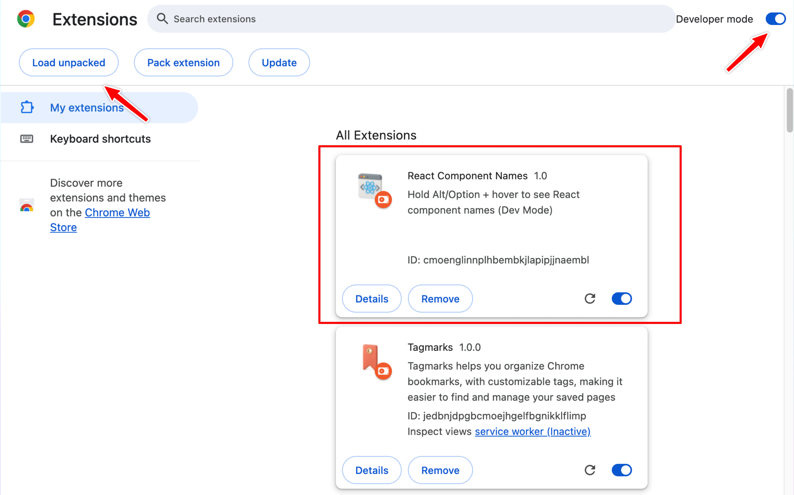

# React Component Names

Quickly locate React component names on any webpage to identify their source code location. Hold **Alt** (or **Option** on macOS) and hover to reveal component names for fast debugging and development.

## Demo

Watch how easy it is to inspect React components:

https://github.com/user-attachments/assets/5b6ae47c-826c-498f-90b4-beb2c9cc340d

## Prerequisites

Before installing this extension, please ensure you have the official React Developer Tools installed:

- Install [React Developer Tools](https://chrome.google.com/webstore/detail/react-developer-tools/fmkadmapgofadopljbjfkapdkoienihi) from the Chrome Web Store

## Installation

You can install this extension in two ways:

1. **Chrome Web Store (Recommended):**

   - Visit the [Chrome Web Store page](https://chromewebstore.google.com/detail/react-component-names/flemaaiegldnehbjdnnhjplnmjccpbod)
   - Click "Add to Chrome" button

2. **Manual Installation:**
   - Follow the Setup instructions below if you want to install from source code

## Manual Setup

1.  **Download the Extension:**

    - Download the latest code as a ZIP file from the [GitHub repository page](https://github.com/vietanhlehuu/cnames).
    - Unzip the downloaded file to a local folder.
      

2.  **Install in Chrome:**

    - Open Chrome and navigate to `chrome://extensions`.
    - Enable "Developer mode" using the toggle switch in the top-right corner.
    - Click the "Load unpacked" button.
    - Select the folder where you unzipped the extension files.
      

## How to Use

- Once installed, navigate to any webpage with a React application.
- Hold down the **Alt** (or **Option** on macOS) key and hover your mouse cursor over different parts of the page.
- A tooltip will appear displaying the name of the React component under the cursor.
  

## Customizing the Trigger Key

If you need to change the trigger key from the default **Alt/Option** key:

1.  **Open the Extension Files:**

    - Locate the folder where you installed the extension (or where you unzipped the files if you are developing it).

2.  **Edit `inspector.js`:**

    - Open the `inspector.js` file in a text editor.
    - Find the line (around line 3):
      ```javascript
      const TRIGGER_KEY = 'Alt';
      ```
    - Change `'Alt'` to your desired key (e.g., `'Control'`, `'Shift'`, or a specific letter like `'i'`). Make sure the key name is a valid JavaScript `KeyboardEvent.key` value.
      - For example, to change it to `Control`:
        ```javascript
        const TRIGGER_KEY = 'Control';
        ```

3.  **Reload the Extension in Chrome:**
    - Go back to `chrome://extensions`.
    - Find the "React Component Names" extension card.
    - Click the reload icon (a circular arrow) on the extension card.

The extension will now use your new custom trigger key.
